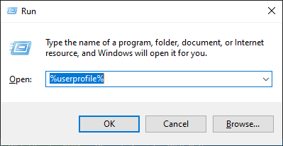
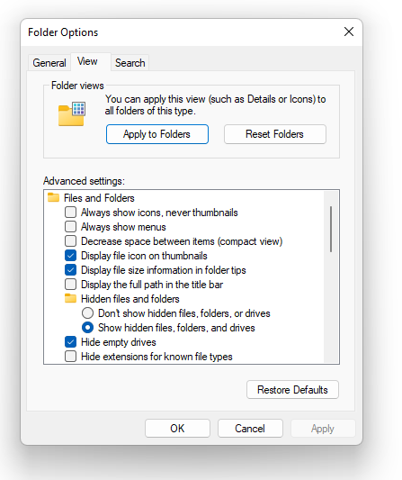
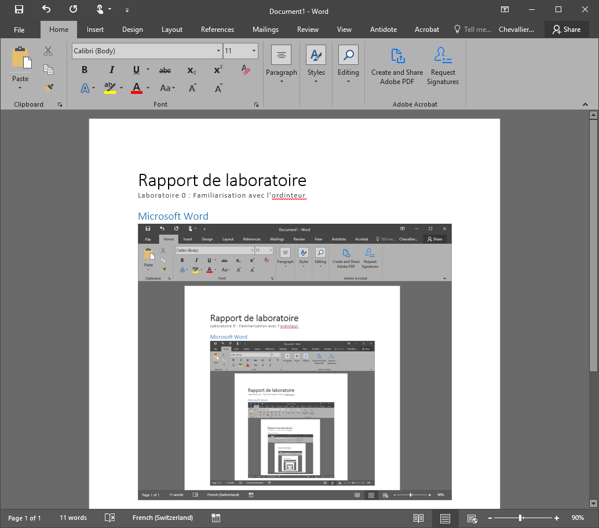
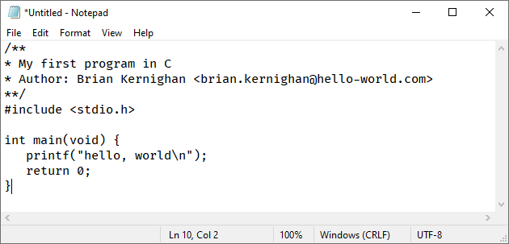

# Labo-00 : Prise en main de l'ordinateur <!-- omit in toc -->

| Type       | Description                           |
| ---------- | ------------------------------------- |
| Durée      | 2 x 45 minutes et travail à la maison |
| Rendu      | Sur GitHub                            |
| Format     | Travail individuel                    |
| Évaluation | Sur la conformité du rendu            |

## Table des matières <!-- omit in toc -->

- [Introduction](#introduction)
- [Ce qu'il faut rendre](#ce-quil-faut-rendre)
- [Systèmes d'exploitation](#systèmes-dexploitation)
- [Prise en main de Windows](#prise-en-main-de-windows)
  - [Accès au réseau](#accès-au-réseau)
  - [Raccourcis clavier](#raccourcis-clavier)
  - [Votre dossier utilisateur](#votre-dossier-utilisateur)
  - [Affichage des fichiers cachés et des extensions](#affichage-des-fichiers-cachés-et-des-extensions)
  - [Le dossier de rendu](#le-dossier-de-rendu)
- [Le rapport avec Microsoft Word](#le-rapport-avec-microsoft-word)
- [Un premier programme avec Notepad](#un-premier-programme-avec-notepad)
- [La calculatrice en mode programmeur](#la-calculatrice-en-mode-programmeur)
- [Windows Terminal et gestionnaire de paquets](#windows-terminal-et-gestionnaire-de-paquets)
- [Visual Studio Code](#visual-studio-code)
  - [Installation avec winget](#installation-avec-winget)
  - [Premiers pas dans l'éditeur](#premiers-pas-dans-léditeur)
- [WSL](#wsl)
- [Premiers pas sous Linux](#premiers-pas-sous-linux)
- [Configurer Ubuntu comme terminal par défaut](#configurer-ubuntu-comme-terminal-par-défaut)
- [Git](#git)
  - [Identité](#identité)
  - [Clé SSH](#clé-ssh)
- [GitHub](#github)
  - [Création du compte](#création-du-compte)
  - [Ajout de la clé publique](#ajout-de-la-clé-publique)
  - [Un aperçu de l'historique](#un-aperçu-de-lhistorique)
- [HEIG Classroom](#heig-classroom)
  - [Clone du dépôt](#clone-du-dépôt)
  - [Préparation du dossier de rendu](#préparation-du-dossier-de-rendu)
  - [Publication](#publication)
- [Résumé](#résumé)

## Introduction

Ce premier travail pratique vous fait prendre en main votre ordinateur et les outils que nous utiliserons tout le semestre. Le cours est essentiellement orienté vers la ligne de commande, nous installerons donc un environnement de travail adapté : un système Linux sous Windows, un éditeur de code et un outil de gestion de versions.

À la fin de ce laboratoire, vous saurez lire un énoncé jusqu'au bout (ce n'est pas si facile, voyez [RTFM](https://fr.wikipedia.org/wiki/RTFM)), suivre une marche à suivre, installer les outils du cours et, surtout, récupérer puis rendre un travail pratique avec Git et GitHub.

Ce travail implique la rédaction d'un rapport. Notez donc au fur et à mesure ce que vous faites. Chaque fois qu'une réponse ou une capture d'écran est attendue, elle est signalée par la mention **Rapport**.

## Ce qu'il faut rendre

Le rendu se fait sur GitHub selon la procédure décrite à la fin de cet énoncé. Il est composé d'un dossier `rendu` qui contient exactement les quatre fichiers suivants :

```text
rendu
├── README.md
├── hello.c
├── rapport.docx
└── two-pies.txt
```

Le rapport `rapport.docx` est un document Word qui contient, dans l'ordre de l'énoncé, les éléments suivants :

1. l'explication des deux séquences de touches ;
2. une capture d'écran de Word ;
3. le chemin de votre dossier utilisateur et la signification de `%userprofile%` ;
4. la réponse à la question sur la nature d'un fichier `.docx` ;
5. les conversions de `DEADBEEF` et une capture d'écran de la calculatrice ;
6. une capture d'écran de Visual Studio Code ;
7. le résultat de la commande `cowsay` demandée ;
8. votre clé SSH publique ;
9. la réponse à la question sur *git blame*.

## Systèmes d'exploitation

Un ordinateur ne fonctionne pas sans système d'exploitation. Les trois familles les plus répandues sont [Microsoft Windows](https://fr.wikipedia.org/wiki/Microsoft_Windows), [macOS](https://fr.wikipedia.org/wiki/MacOS) et [Linux](https://fr.wikipedia.org/wiki/Linux). Windows domine la bureautique, mais Linux règne sur les serveurs et les systèmes embarqués : votre téléphone Android tourne sous Linux, votre iPhone repose sur une base Unix, et il en va de même pour la plupart des objets connectés, des voitures et des satellites.

Un ingénieur doit donc être à l'aise dans les deux mondes. Depuis 2016, Microsoft propose **Windows Subsystem for Linux** (WSL), une couche de compatibilité qui permet d'exécuter une véritable [distribution Linux](https://fr.wikipedia.org/wiki/Distribution_Linux) à l'intérieur de Windows, sans machine virtuelle à configurer. Le système obtenu respecte le standard [POSIX](https://fr.wikipedia.org/wiki/POSIX) et constitue une base solide pour développer plus tard sur [Raspberry Pi](https://fr.wikipedia.org/wiki/Raspberry_Pi) ou d'autres [systèmes embarqués](https://fr.wikipedia.org/wiki/Syst%C3%A8me_embarqu%C3%A9).

C'est cet outil que nous utiliserons durant le semestre. Si vous travaillez sous macOS ou Linux, vous n'en avez pas besoin : votre terminal fait déjà l'affaire. Avant de l'installer, familiarisons-nous avec Windows.

## Prise en main de Windows

### Accès au réseau

Démarrez votre ordinateur et connectez-vous au réseau WiFi de l'école avec vos identifiants personnels en notation antique "8.8" (soit au maximum 8 caractères de votre nom et de votre prénom, `yves.chevallier` devient `yves.chevalli`). Votre nom d'utilisateur est donc composé de votre prénom et de votre nom séparés par un point. Il est parfois nécessaire de le préfixer par le nom du domaine de l'école avec un *backslash* : `einet\yves.chevalli`.

> En informatique, on évite les espaces dans les noms et si on le peut les majuscules. Plusieurs conventions existent : `YvesChevallier` (PascalCase), `yvesChevallier` (camelCase), `yves-chevallier` (kebab-case, les mots sont enfilés sur une pique) et `yves_chevallier` (snake_case). La HEIG-VD utilise le point, `yves.chevallier`, comme dans les adresses e-mail.

Une fois connecté, vérifiez que vous accédez à votre boîte e-mail de la HES-SO, à Microsoft Teams et à l'intranet de l'école.

Validez les points suivants :

- [ ] Je me suis connecté au réseau Wifi
- [ ] J'ai accès à ma boîte e-mail
- [ ] J'ai accès à Microsoft Teams
- [ ] J'ai accès à l'intranet de l'école (intra.heig-vd.ch)

### Raccourcis clavier

Un (vrai) informaticien fait presque tout au clavier. Avec l'expérience, c'est plus rapide que la souris, et apprendre les raccourcis est un investissement qui paie toujours. Commençons par le menu Démarrer.

Un bref appui sur la touche **Windows** (à gauche de la barre d'espace, entre `<CTRL>` et `<ALT>`) ouvre le menu Démarrer. Tapez alors quelques lettres pour rechercher un programme : `calc` puis `<ENTER>` ouvre la calculatrice. Plus efficace encore, la combinaison `<WIN>+<R>` ouvre la boîte de dialogue **Exécuter**, dans laquelle on saisit directement le nom d'un programme : `notepad` puis `<ENTER>` ouvre l'éditeur de texte Notepad.

Quelques autres raccourcis avec la touche Windows vous serviront tous les jours. `<WIN>+<E>` ouvre l'explorateur de fichiers, `<WIN>+<L>` verrouille la session, `<WIN>+<MAJ>+<S>` lance l'outil de capture d'écran, `<WIN>+<D>` affiche le bureau et `<WIN>+<V>` ouvre l'historique du presse-papiers. Essayez-les.

> **Notation.** Dans ce cours, les chevrons désignent une touche du clavier : `<TAB>` est la touche de tabulation, alors que `TAB` désigne la frappe des trois caractères `T`, `A` et `B`. Le signe `+` indique une combinaison, c'est-à-dire des touches maintenues simultanément : `<CTRL>+<R>` signifie maintenir `<CTRL>` et appuyer sur `R`. Sur internet, cette notation est souvent abrégée en `<C-R>`. À vous de l'interpréter selon le contexte.

Avez-vous compris ? Voici deux séquences de touches. Exécutez-les dans l'ordre, puis observez ce qu'elles font.

```text
<WIN>+<R> calc <ENTER> <ALT>+<1> <ESC> 3.14 * 2 = <CTRL>+<C> <ALT>+<F4>
```

```text
<W-R> notepad <ENTER> <C-V> <C-S> two-pies.txt <ENTER>
```

> **Rapport.** Expliquez en une phrase ce que fait chacune des deux séquences. Conservez le fichier `two-pies.txt`, il fait partie du rendu.

Validez les points suivants :

- [ ] J'ai compris la notation des raccourcis clavier
- [ ] Je sais exécuter un programme depuis la boîte de dialogue Exécuter
- [ ] Je sais ouvrir la calculatrice et le notepad avec des raccourcis clavier
- [ ] J'ai pu générer le fichier `two-pies.txt` et j'ai compris ce qui s'est passé

### Votre dossier utilisateur

Exécutez `%userprofile%` depuis la boîte de dialogue Exécuter (`<W-R>`). L'explorateur de fichiers s'ouvre sur votre dossier personnel, celui qui contient vos documents, images et téléchargements, ainsi que des dossiers cachés où les applications rangent leurs paramètres.



> **Rapport.** Quel est le chemin complet de ce dossier ? Que signifie la notation `%userprofile%` et que signifie les `%` ? Cherchez sur internet si vous ne le savez pas.

- [ ] J'ai trouvé le chemin complet de mon dossier utilisateur et je l'ai consigné dans mon rapport
- [ ] J'ai compris la signification de `%userprofile%` et des `%` et je l'ai consigné dans mon rapport

### Affichage des fichiers cachés et des extensions

Par défaut, Windows cache une partie de l'information, ce qui n'est pas idéal pour un ingénieur mais ô combien plus pratique pour vos grands parents. Exécutez `control folders` depuis la boîte Exécuter, ouvrez l'onglet **Affichage** (*View*) et réglez trois options :

- cochez **Afficher le chemin complet dans la barre de titre**,
- cochez **Afficher les fichiers, dossiers et lecteurs cachés**,
- décochez **Masquer les extensions des fichiers dont le type est connu**.



La deuxième option rend visibles les fichiers cachés, comme le fichier `.gitignore` que nous rencontrerons plus tard. La troisième affiche l'extension des fichiers, c'est-à-dire ce qui suit le point dans leur nom. Elle est indispensable : `hello.c` est un fichier source C alors que `hello.exe` est un programme exécutable, et sans extension vous ne verriez que `hello` dans les deux cas.

Validez les points suivants :

- [ ] J'ai compris la signification des fichiers cachés et des extensions
- [ ] J'ai modifié les options d'affichage dans l'explorateur de fichiers et je peux voir les fichiers cachés et les extensions
- [ ] J'ai compris la différence entre un fichier source et un exécutable et je l'ai consigné dans mon rapport

### Le dossier de rendu

Dans votre dossier `Documents` (dans votre `%userprofile%`), créez un dossier nommé `rendu` et déplacez-y le fichier `two-pies.txt`. Ce dossier ne contient pour l'instant qu'un seul fichier, les autres viendront s'y ajouter au fil de l'énoncé. Notez la hiérarchie : `rendu` est dans `Documents`, lui-même dans votre dossier personnel. C'est ce que l'on appelle une arborescence.

L'organisation des fichiers sur votre machine est donc hiérarchique:

```text
C:\
└── Users
    └── Yves Chevallier
        └── Documents
            └── rendu
                └── two-pies.txt
```

- [ ] J'ai mon dossier `rendu` avec le fichier `two-pies.txt`
- [ ] J'ai compris la notion d'arborescence

## Le rapport avec Microsoft Word

Word est le traitement de texte le plus utilisé dans l'industrie. Que vous l'aimiez ou non, vous y serez confronté dans votre carrière. Créons dès maintenant le rapport, que vous compléterez au fur et à mesure.

1. Lancez Word avec `<WIN>+<R> winword <ENTER>` et créez un nouveau document vide.
2. Dans le menu **Styles**, choisissez le style **Titre** et écrivez `Rapport de laboratoire`.
3. Avec le style **Sous-titre**, écrivez `Laboratoire 00 : Prise en main de l'ordinteur`.
4. Word souligne la faute en rouge. Corrigez-la avec un clic droit sur le mot.
5. Ajoutez votre nom, votre prénom et la date du jour.
6. Insérez un titre de section `Microsoft Word` avec le style **Titre 1** (raccourci `<CTRL>+<ALT>+<1>`).
7. Faites une capture d'écran de Word avec `<WIN>+<MAJ>+<S>` et collez-la dans le document. Voici ce que vous pourriez obtenir :

   

8. Enregistrez le document sous le nom `rapport.docx` dans votre dossier `rendu` et gardez-le ouvert. Vous y ajouterez un titre de section pour chaque étape suivante de ce laboratoire.

Une petite curiosité pour terminer. L'extension `.docx` signifie que Word stocke vos données au format XML, dans une archive compressée. Créez un second document contenant simplement la phrase `les biscuits au beurre`, enregistrez-le sous `biscuit.docx`, puis renommez-le `biscuit.zip` dans l'explorateur (`<F2>` après avoir sélectionné le fichier), ce qui est possible puisque les extensions sont maintenant affichées. L'icône change et vous pouvez ouvrir l'archive. Ouvrez avec Notepad le fichier `word/document.xml` qu'elle contient : votre phrase s'y trouve, entourée de balises.

```xml
<w:p>
   <w:r>
      <w:t>les biscuits au beurre</w:t>
   </w:r>
</w:p>
```

- [ ] J'ai créé mon rapport et je l'ai placé dans le dossier `rendu`
- [ ] J'ai pu faire la capture d'écran avec `<WIN>+<MAJ>+<S>` et je l'ai collée dans Word
- [ ] J'ai compris que le document Word est stocké dans un format texte compressé

## Un premier programme avec Notepad

Notepad est un éditeur de texte rudimentaire, mais diantrement utile. Ouvrez-le (`<WIN>+<R> notepad <ENTER>`) et saisissez le programme C suivant, en **remplaçant le nom de l'auteur** par le vôtre :

```c
/**
 * My first program in C
 * Author: Brian Kernighan <brian.kernighan@hello-world.com>
 */
#include <stdio.h>

int main(void) {
   printf("hello, world\n");
   return 0;
}
```



Enregistrez-le sous le nom `hello.c` dans votre dossier `rendu`. Attention, dans la boîte de dialogue d'enregistrement, choisissez le type **Tous les fichiers** et non **Document texte**, sinon Notepad ajoute `.txt` et votre fichier s'appellera `hello.c.txt`. Vérifiez le nom obtenu dans l'explorateur.

Bravo, vous venez d'écrire votre premier programme C. Nous le compilerons et l'exécuterons sous Linux à la fin de ce laboratoire.

Validez les points suivants :

- [ ] J'ai créé le fichier `hello.c` dans mon dossier `rendu`
- [ ] J'ai remplacé le nom de l'auteur par le mien
- [ ] J'ai vérifié que le fichier s'appelle bien `hello.c` et non `hello.c.txt`

## La calculatrice en mode programmeur

La calculatrice de Windows cache un mode très utile pour ce cours : le mode programmeur, qui affiche un nombre simultanément en hexadécimal (HEX), décimal (DEC), octal (OCT) et binaire (BIN). Sachez au passage que le code source de cette calculatrice est public. Il est hébergé sur [GitHub](https://github.com/microsoft/calculator), une plateforme que vous découvrirez plus bas.

1. Ouvrez la calculatrice (`calc` dans la boîte Exécuter).
2. Ouvrez le menu de navigation (icône hamburger en haut à gauche) et choisissez **Programmeur**. Un raccourci clavier existe aussi : trouvez-le en cherchant `how to enter programmer mode in calc on windows` sur internet.
3. Sélectionnez la base **HEX** et saisissez la valeur `DEADBEEF`.
4. Vérifiez visuellement ue la valeur décimale est bien `3'735'928'559`.
5. Activez le **clavier de commutation des bits** (première icône sous l'affichage, à gauche de `QWORD`). Chaque bit est affiché individuellement et peut être inversé d'un clic.
6. Commutez les bits 29 et 22. Le bit 0 est le plus à droite.

> **Rapport.** Quel est le nouveau nombre hexadémical affiché ? Et est-ce que la calculatrice à un rapport avec la nourriture de la viande de boeuf ?

Une Citroën 2CV sortie en 1948 délivrait en réalité 9 chevaux vapeurs. En 2026, l'unité de puissance est le watt, et un cheval vapeur vaut exactement 735,49875 watts. Depuis votre calculatrice allez dans le menu et choisissez **Convertisseur d'unités**, puis **Puissance**, et convertissez 9 chevaux vapeur en kilowatts.

- [ ] J'ai compris le fonctionnement de la calculatrice en mode programmeur et j'ai consigné le résultat dans mon rapport.
- [ ] J'ai compris la signification de hexadécimal, binaire et décimal.
- [ ] Combien de kilowatts délivre une deux chevaux de 1948 ?

> Notez le fait amusant qu'un cheval vapeur est défini comme la puissance nécessaire pour élever 75 kg à la vitesse de 1 mètre par seconde. Ce 75 est un arrondi d'une expérience de James Watt dans les années 1780 qui a mesuré la puissance d'un cheval de trait comme argument commercial pour vendre ses machines à vapeur. En réalité un cheval ne peut maintenir cette puissance que quelques secondes, l'unité du cheval vapeur est donc une fiction.

## Windows Terminal et gestionnaire de paquets

[Windows Terminal](https://learn.microsoft.com/fr-fr/windows/terminal/) est un interpréteur de commandes moderne, qui remplace avantageusement l'ancien *cmd.exe* et PowerShell. Il permet d'ouvrir plusieurs onglets, de personnaliser les couleurs et les polices, et surtout d'exécuter des programmes Linux avec WSL.

[Windows Package Manager](https://learn.microsoft.com/fr-fr/windows/package-manager/) (winget) est un gestionnaire de paquets qui permet d'installer des logiciels depuis la ligne de commande. Il est intégré dans Windows depuis la version 10.0.22000 (Windows 11) et est disponible sur Windows 10 via l'application [App Installer](https://www.microsoft.com/store/productId/9NBLGGH4NNS1). Il est très pratique pour installer des logiciels sans passer par des sites web parfois douteux.

On va utiliser `winget` pour installer `Windows Terminal` qui n'est pas toujours préinstallé. Exécutez (`<WIN>+<R>`) puis `cmd.exe` ou `powershell` et tapez :

```powershell
winget install --id Microsoft.WindowsTerminal -e
```

À partir de maintenant pour lancer un terminl faites `<WIN>+<R> wt <ENTER>`.

- [ ] J'ai pu installer Windows Terminal avec winget
- [ ] J'ai pu lancer Windows Terminal avec `<WIN>+<R> wt <ENTER>`

## Visual Studio Code

[Visual Studio Code](https://code.visualstudio.com/) est un éditeur de code gratuit et extensible, développé par Microsoft pour Windows, Linux et macOS. Il est l'éditeur le plus utilisé par les développeurs depuis plusieurs années (voyez le [sondage Stack Overflow 2025](https://survey.stackoverflow.co/2025/technology#most-popular-technologies-dev-envs-dev-envs)) et il s'intègre très bien avec Linux sous Windows. C'est l'éditeur retenu pour ce cours.

- [ ] Consignez dans votre rapport quel est le pourcentage d'utilisateurs de Visual Studio Code selon le sondage Stack Overflow 2025.
- [ ] Notez aussi combien de développeurs utilisent Vim

### Installation avec winget

Installez Visual Studio Code avec la commande suivante dans Windows Terminal :

```powershell
winget install --id Microsoft.VisualStudioCode
```

Acceptez les conditions d'utilisation si winget vous le demande et patientez jusqu'à la fin de l'installation. Pour un autre logiciel, la commande `winget search` suivie d'un nom permet de trouver l'identifiant à installer.

- [ ] J'ai installé Visual Studio Code
- [ ] J'ai compris le rôle d'un gestionnaire de paquets et sa facilité d'utilisation

### Premiers pas dans l'éditeur

Lancez Visual Studio Code puis, avec `<CTRL>+<K> <CTRL>+<O>`, ouvrez votre dossier `rendu`. La liste de ses fichiers apparaît à gauche. Ouvrez `hello.c` : cette fois-ci, le code est coloré. Avec `<CTRL>+<SHIFT>+<P>`, ouvrez la palette de commandes, cherchez `Preferences: Color Theme` et choisissez un thème qui vous convient. Préférez-vous un thème clair ou sombre ?

L'anglais est la langue de la programmation. Gardez Visual Studio Code en anglais, comme tous vos outils de développement : vous y gagnerez chaque fois que vous chercherez de l'aide sur internet.

Ouvrez ensuite la vue des extensions avec `<CTRL>+<SHIFT>+<X>` et installez les extensions suivantes:

- `clangd` pour l'analyse du code C/C++ et l'autocomplétion,
- `C/C++` pour le débogage et l'exécution du code C/C++.
- `Hex Editor` pour visualiser les fichiers binaires en hexadécimal.
- `WSL` pour connecter Visual Studio Code à la distribution Linux.

L'extension **WSL** est publiée par Microsoft, elle permet à l'éditeur de travailler directement dans le système Linux que nous installons à l'étape suivante. Notez dans votre rapport combien de millions d'utilisateurs ont installé l'extension WSL et quel est la satisfaction moyenne des utilisateurs. Est-ce plutôt rassurant ?

Pour terminer, une démonstration de ce qu'un bon éditeur sait faire. Créez un nouveau fichier avec `<CTRL>+<N>` et copiez-y l'anaphore de Louis Aragon (*Strophes pour se souvenir*) :

```text
Vingt et trois qui donnaient le cœur avant le temps
Vingt et trois étrangers et nos frères pourtant
Vingt et trois amoureux de vivre à en mourir
```

Placez le curseur sur le mot `trois` et pressez `<CTRL>+<D>` trois fois : chaque appui sélectionne l'occurrence suivante du mot. Tapez alors `quatre` : les trois occurrences sont modifiées en même temps. Placez maintenant votre curseur n'importe quel mot `Vingt` et pressez `<CTRL>+<SHIFT>+<L>` : vous sélectionnez toutes les occurrences du mot. Vous venez d'utiliser les **curseurs multiples**. Ce fichier n'est pas à rendre, fermez-le sans l'enregistrer.

> **Rapport.** Insérez une capture d'écran de Visual Studio Code montrant `hello.c` avec le thème que vous préférez.

- [ ] J'ai pu lancer Visual Studio Code
- [ ] J'ai choisi un thème et je l'ai consigné dans mon rapport
- [ ] J'ai pu installer les extensions demandées
- [ ] J'ai compris l'utilisation des curseurs multiples

> Fait amusant, si vous vous sentez stressé par vos études, vous pouvez installer l'extension VsCode `Aquarium` ou `VSCode Pets`...

## WSL

Installons maintenant Linux (Yeah !).

La première étape est de s'assurer que vous avez bien activé les options Windows nécessaires. Menu démarrer exécuter puis `optionalfeatures.exe` et cochez les options suivantes :

- Sous-système Windows pour Linux (Windows Subsystem for Linux)
- Plateforme de machine virtuelle (Virtual Machine Platform)

Si nécessaire redémarrez l'ordinateur.

Ouvrez ensuite le Terminal Windows **en tant qu'administrateur** (clic droit sur Terminal dans le menu Démarrer, puis *Exécuter en tant qu'administrateur*) et saisissez :

```powershell
wsl --install
```

Cette commande active WSL et installe la distribution **Ubuntu**. Redémarrez l'ordinateur lorsqu'il vous le demande. Au redémarrage, une fenêtre Ubuntu s'ouvre et termine l'installation. Si ce n'est pas le cas, lancez `Ubuntu` depuis le menu Démarrer. Il vous est alors demandé de choisir un nom d'utilisateur, par exemple vos initiales en minuscules ou votre pseudo Steam ou Discord, puis un mot de passe.

**Ne sautez pas cette étape.** Choisissez un mot de passe simple : vous le saisirez souvent et il ne protège que ce système Linux. Le mot de passe ne s'affiche pas pendant la frappe, c'est normal. **Et ne l'oubliez pas**.

En cas de difficulté, la [documentation de Microsoft](https://learn.microsoft.com/fr-fr/windows/wsl/install) décrit l'installation en détail.

- [ ] J'ai installé WSL et Ubuntu
- [ ] J'ai configuré mon nom d'utilisateur et mon mot de passe

## Premiers pas sous Linux

Ouvrez le Terminal Windows et, dans le menu déroulant `v` à droite du `+`, choisissez **Ubuntu**. Vous êtes maintenant dans un interpréteur de commandes Linux, appelé *shell*. Commencez par mettre à jour la liste des logiciels disponibles :

```sh
sudo apt update
```

Le programme `sudo` exécute la commande qui le suit avec les droits d'administrateur, d'où la demande de mot de passe, et `apt` est le gestionnaire de paquets d'Ubuntu (comme winget sous Windows). Installez ensuite le programme `cowsay` ainsi que `gcc`, le compilateur C dont nous aurons besoin plus loin :

```sh
sudo apt install cowsay gcc
```

Exécutez `cowsay` suivi d'une phrase de votre choix :

```text
$ cowsay Meuuuuuh
 __________
< Meuuuuuh >
 ----------
        \   ^__^
         \  (oo)\_______
            (__)\       )\/\
                ||----w |
                ||     ||
```

Chaque programme Linux possède un manuel. Affichez celui de `cowsay` avec `man cowsay`, naviguez avec les flèches et quittez avec `q`. Cherchez ce que fait l'option `-d` et essayez-la. Le comportement d'un programme se modifie ainsi avec des **options**, reconnaissables à leur tiret, placées après son nom.

> **Rapport.** À l'aide du manuel, trouvez la commande qui affiche le résultat ci-dessous, exécutez-la et copiez le résultat obtenu dans votre rapport.

```text
 _____________________
( Bilbon, je t'aurais )
 ---------------------
      o                    / \  //\
       o    |\___/|      /   \//  \\
            /0  0  \__  /    //  | \ \
           /     /  \/_/    //   |  \  \
           @_^_@'/   \/_   //    |   \   \
           //_^_/     \/_ //     |    \    \
        ( //) |        \///      |     \     \
      ( / /) _|_ /   )  //       |      \     _\
    ( // /) '/,_ _ _/  ( ; -.    |    _ _\.-~        .-~~~^-.
  (( / / )) ,-{        _      `-.|.-~-.           .~         `.
 (( // / ))  '/\      /                 ~-. _ .-~      .-~^-.  \
 (( /// ))      `.   {            }                   /      \  \
  (( / ))     .----~-.\        \-'                 .~         \  `. \^-.
             ///.----..>        \             _ -~             `.  ^-`  ^-_
               ///-._ _ _ _ _ _ _}^ - - - - ~                     ~-- ,.-~
                                                                  /.-~
```

Retenez trois choses : `apt install` installe un programme, `man` affiche son manuel et les options changent son comportement.

- [ ] J'ai pu installer `cowsay` et `gcc`
- [ ] J'ai pu lire le manuel de `cowsay` avec `man cowsay`
- [ ] J'ai compris le rôle des options et je l'ai consigné dans mon rapport
- [ ] J'ai trouvé la commande demandée et je l'ai consignée dans mon rapport

## Configurer Ubuntu comme terminal par défaut

Vous avez le choix mais je vous recommande de configurer Ubuntu comme terminal par défaut. Dans Windows Terminal, ouvrez les paramètres avec `<CTRL>+,` et, dans la section **Démarrage**, choisissez **Ubuntu** comme profil par défaut.

- [ ] J'ai configuré Ubuntu comme terminal par défaut

## Git

[Git](https://git-scm.com/) est le logiciel de gestion de versions utilisé par la quasi-totalité des développeurs. Dans ce cours, il sert à récupérer les énoncés et à rendre vos travaux. Il est déjà installé avec Ubuntu, mais il faut le configurer.

### Identité

Git associe chaque modification à un nom et à une adresse e-mail. Configurez les vôtres depuis le terminal Ubuntu, en remplaçant ce cher Emmett par votre propre identité :

```sh
git config --global user.name "Emmett Lathrop Brown"
git config --global user.email emmett.brown@heig-vd.ch
```

Observez la structure de cette commande. `git` est le programme, `config` est la sous-commande, `--global` est une option (reconnaissable à ses deux tirets) qui indique que le réglage vaut pour tout le système, `user.name` est le paramètre modifié et `"Emmett Lathrop Brown"` sa valeur, entre guillemets parce qu'elle contient des espaces. Tout ce qui suit le nom du programme s'appelle des **arguments**.

Configurez également quelques options utiles pour la suite :

```sh
git config --global core.autocrlf false
git config --global core.filemode false
git config --global core.symlinks false
git config --global --add safe.directory '*'
git config --global init.defaultBranch main
git config --global pull.rebase true
git config --global push.autoSetupRemote true
git config --global core.editor "code --wait" # Ou vim ou nano si vous préférez
```

Notez que dans un terminal, par défaut le bouton droit de la souris colle le contenu du presse-papiers. Donc pour exécuter les commandes ci-dessus, vous pouvez les copier depuis ce document et les coller dans le terminal avec un clic droit, puis valider avec `<ENTER>`. Vous pouvez vérifier vos réglages avec :

```sh
git config --list
```

On profite de l'occasion pour aussi installer Git sous Windows, ce qui sera utile pour d'autres cours. Dans un terminal Windows (`cmd.exe` ou PowerShell), exécutez :

```powershell
winget install --id Git.Git -e
```

Puis pour réutilser les mêmes réglages que sous Linux, exécutez les mêmes commandes `git config` que ci-dessus, mais depuis le terminal Windows.

- [ ] J'ai installé Git sous Ubuntu et j'ai configuré mon identité Git
- [ ] J'ai vérifié mes réglages avec `git config --list` et j'ai consigné ces règlages dans mon rapport
- [ ] J'ai installé Git sous Windows et j'ai configuré mon identité Git

### Clé SSH

Pour communiquer de façon sécurisée avec d'autres ordinateurs, et en particulier avec GitHub, vous avez besoin d'une paire de clés cryptographiques, dite *clé SSH* (*Secure Shell*). Une clé SSH est composée d'une **clé privée** et d'une **clé publique**. La clé privée reste sur votre ordinateur et ne doit jamais être communiquée à qui que ce soit. La clé publique peut être transmise à tous ceux qui souhaitent communiquer avec vous.

Créez-la depuis un terminal Ubuntu avec :

```sh
ssh-keygen
```

Acceptez toutes les valeurs par défaut en appuyant sur `<ENTER>` jusqu'à la fin, y compris pour la *passphrase*, que vous laisserez vide à moins de travailler pour une agence de renseignement. Vous obtenez quelque chose comme ceci :

```text
Generating public/private ed25519 key pair.
Enter file in which to save the key (/home/doc/.ssh/id_ed25519):
Created directory '/home/doc/.ssh'.
Enter passphrase (empty for no passphrase):
Enter same passphrase again:
Your identification has been saved in /home/doc/.ssh/id_ed25519
Your public key has been saved in /home/doc/.ssh/id_ed25519.pub
The key fingerprint is:
SHA256:roMkIIUQP4DcTzitPsPCNjIA/myLCwZbjkQl0wJ6xm0 doc@hill-valley
```

Deux fichiers ont été créés dans le dossier caché `.ssh` de votre dossier personnel. La **clé privée** `id_ed25519` ne doit jamais être communiquée à qui que ce soit, ni à vos amis, ni à votre professeur. La **clé publique** `id_ed25519.pub` en découle et peut être transmise à tous ceux qui souhaitent communiquer avec vous. Affichez-la avec le programme `cat`, qui montre le contenu d'un fichier :

```sh
cat ~/.ssh/id_ed25519.pub
```

Vous obtenez une ligne commençant par `ssh-ed25519`, suivie d'une longue suite de caractères, par exemple :

```text
ssh-ed25519 AAAAC3NzaC1lZDI1NTE5AAAAIBiKGoMLwS80YMnoMz4AXNGlt9EoVZbZ0WE5MVPKp1DU doc@hill-valley
```

> **Rapport.** Copiez votre clé publique dans le rapport.

Maintenant, si vous voulez impressionner votre professeur et gagner des points supplémentaires, ajoutez aussi à votre rapport le contenu de votre clé privée, que vous obtenez avec `cat ~/.ssh/id_ed25519`.

- [ ] J'ai créé ma paire de clés SSH et j'ai copié ma clé publique dans mon rapport

## GitHub

[GitHub](https://github.com/) est la plateforme d'hébergement de projets Git la plus utilisée au monde. Elle permet de partager du code et de collaborer, notamment sur des projets *open source* comme la calculatrice Windows vue plus haut. Les travaux pratiques de ce cours passent par GitHub.

### Création du compte

Si vous n'en avez pas encore, créez un compte sur [GitHub](https://github.com/) avec *Sign up*. Choisissez comme nom d'utilisateur `prenom-nom`, en **minuscules** et avec un tiret (kebab-case), ce qui est le format consensuellement utilisé. Utilisez votre adresse e-mail de la HEIG-VD : elle donne accès aux avantages de [GitHub Education](https://education.github.com/).

Si vous avez déjà un compte personnel, vous pouvez l'utiliser pour vos études.

- [ ] Je dispose maintenant d'un compte GitHub.

### Ajout de la clé publique

Pour que GitHub reconnaisse votre ordinateur, ajoutez-lui votre clé publique. Sur GitHub, ouvrez *Settings* depuis le menu de votre avatar en haut à droite, puis *SSH and GPG keys*. Cliquez sur *New SSH key*, nommez la clé `HEIG-VD` et collez la ligne obtenue avec `cat ~/.ssh/id_ed25519.pub`.

Votre mot de passe GitHub protège l'accès au site. Votre clé SSH, elle, permet à votre ordinateur d'échanger des données avec GitHub sans saisir de mot de passe à chaque fois. Elle n'est pas réservée à GitHub : elle vous servira aussi à vous connecter à distance à d'autres machines, un Raspberry Pi par exemple.

- [ ] J'ai ajouté ma clé publique à mon compte GitHub

### Un aperçu de l'historique

GitHub conserve l'historique complet de chaque fichier. Pour le constater, ouvrez le fichier [addrman.cpp](https://github.com/bitcoin/bitcoin/blob/d0f81a96d9c158a9226dc946bdd61d48c4d42959/src/addrman.cpp) du code source de Bitcoin et cherchez-y une [DeLorean](https://fr.wikipedia.org/wiki/DeLorean_DMC-12) avec `<CTRL>+<F>`. Cliquez sur le numéro de la ligne trouvée, puis sur les trois petits points, et choisissez *View git blame*. Pour chaque ligne du fichier, GitHub indique qui l'a écrite, quand, et avec quel message.

> **Rapport.** Qui a écrit cette ligne, et en quelle année ? Expliquez en une ou deux phrases à quoi sert la fonctionnalité *git blame*.

- [ ] J'ai trouvé l'auteur de la ligne et j'ai consigné son nom et l'année dans mon rapport
- [ ] J'ai compris la blague avec la DeLorean

## HEIG Classroom

Rendez-vous sur [HEIG Classroom](https://classroom.chevallier.io/) et connectez-vous avec votre compte edu-ID. Ce projet développé par votre professeur permet de gérer les travaux pratiques de ce cours. Une fois connecté, activez le lien avec votre compte GitHub en utilisant le bouton visible. Acceptez également l'assignment *Labo-00*.

Rendez-vous ensuite sur GitHub en cliquant sur le lien fourni. Cela vous mène sur votre dépôt personnel, sur lequel vous allez publier vos travaux.

### Clone du dépôt

Un *clone* est une copie locale complète d'un dépôt. Depuis votre navigateur et la page GitHub de votre dépôt, cliquez sur le bouton vert *<> Code* puis sélectionnez *SSH* et copiez l'adresse affichée.

Depuis le terminal Ubuntu, clonez le vôtre avec l'adresse que vous venez de copier :

```sh
git clone git@github.com:organisation/labo-00-votre-nom.git
```

À la première connexion, SSH vous demande de confirmer l'identité du serveur GitHub (`Are you sure you want to continue connecting?`) : répondez `yes`. Entrez ensuite dans le dossier créé avec `cd labo-00-votre-nom` (tapez `cd labo` puis `<TAB>` pour que le shell complète le nom) et ouvrez-le dans Visual Studio Code avec `code .` sans oublier l'espace et le point. Au premier lancement, quelques instants sont nécessaires pour que l'éditeur s'installe dans WSL. Vous y retrouvez cet énoncé, le fichier `README.md` à la racine du dépôt.

Ces trois commandes, `git clone`, `cd` et `code .`, seront votre routine à chaque nouveau laboratoire.

- [ ] Je me suis connecté à HEIG Classroom
- [ ] J'ai activé le lien avec mon compte GitHub
- [ ] J'ai cloné mon dépôt et je l'ai ouvert dans Visual Studio Code

### Préparation du dossier de rendu

Terminez d'abord votre rapport Word et enregistrez-le. Puis, depuis le terminal, dans le dossier du dépôt, créez le dossier de rendu et ouvrez-le dans l'explorateur de fichiers Windows :

```sh
mkdir rendu
explorer.exe rendu
```

Copiez-y les fichiers `hello.c`, `two-pies.txt` et `rapport.docx` depuis votre dossier `Documents\rendu`. Revenez au terminal et compilez votre programme :

```sh
cd rendu
gcc hello.c -o hello
./hello
```

Le compilateur `gcc` traduit votre code source en un programme exécutable nommé `hello`, que la commande `./hello` exécute. Le texte `hello, world` s'affiche. Un exécutable ne se publie pas dans un dépôt Git, on ne partage que les sources : supprimez-le avec `rm hello`.

### Publication

Il reste à publier vos fichiers sur GitHub. Depuis le terminal, revenez à la racine du dépôt avec `cd ..` puis saisissez :

```sh
git add rendu
git commit -m "Rendu du laboratoire 00"
git push
```

La commande `git add` sélectionne les fichiers à publier, `git commit` enregistre une version accompagnée d'un message qui la décrit et `git push` envoie cette version sur GitHub. Rendez-vous sur la page de votre dépôt et vérifiez que le dossier `rendu` et ses quatre fichiers y apparaissent. Votre professeur peut maintenant y accéder et évaluer votre travail. Vous pouvez répéter ces trois commandes autant de fois que nécessaire jusqu'à la date limite.

## Résumé

Bravo, vous avez terminé ce premier travail pratique. En chemin, vous avez configuré Windows pour qu'il vous montre les extensions et les fichiers cachés, rédigé un rapport Word, écrit votre premier programme C puis l'avez compilé sous Linux, installé Visual Studio Code, WSL et Ubuntu, configuré Git, créé une clé SSH et un compte GitHub, et enfin publié votre travail. Les commandes `git clone`, `git add`, `git commit` et `git push` n'ont plus de secret pour vous, ou presque : vous les utiliserez à chaque laboratoire.
